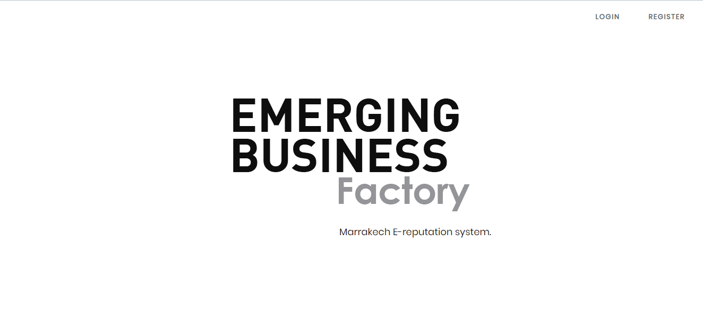
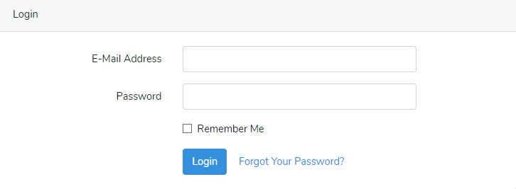
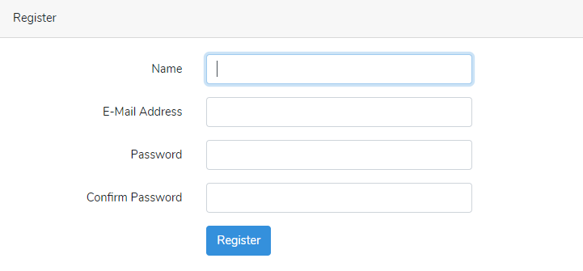
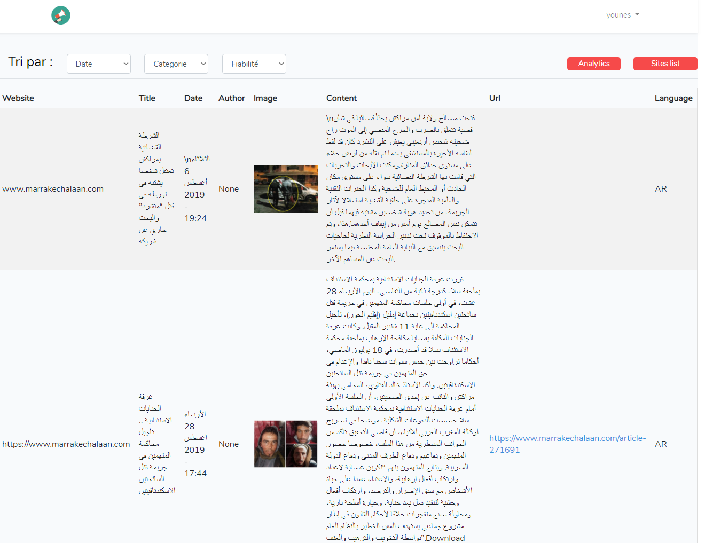
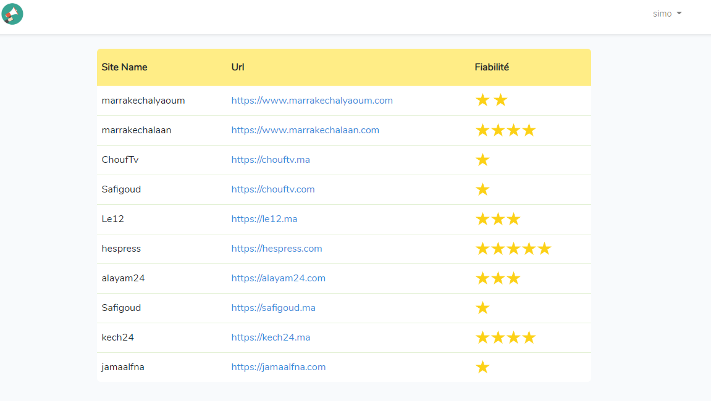
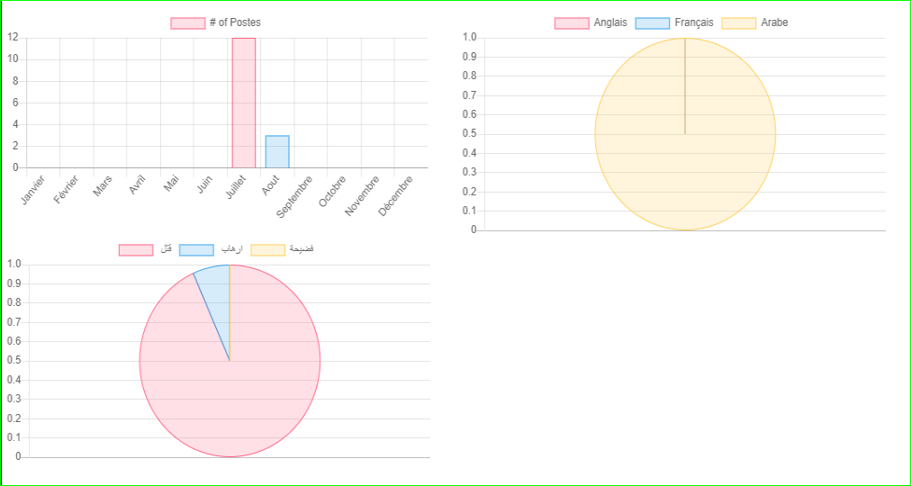

# Le but du projet

> Cette section explique le but derrière le projet E-réputation.

## Le produit

Le livrable offre aux utilisateurs plusieurs services, tout en maintenant un flux fluide.

## Les services

### authentification

### Accéder aux articles

Les membres de la CNT peuvent visualiser les articles reçu qui ont un rapport avec un des mots clés.

### voir la liste des sites scrappés 

Les membres de la CNT peuvent aussi voir la liste des sites scrappés notés de 1 à 5 pour assurer la fiabilité.

### checker les statistiques

Les membres de la CNT peuvent checker les statisques par le dashboard.

