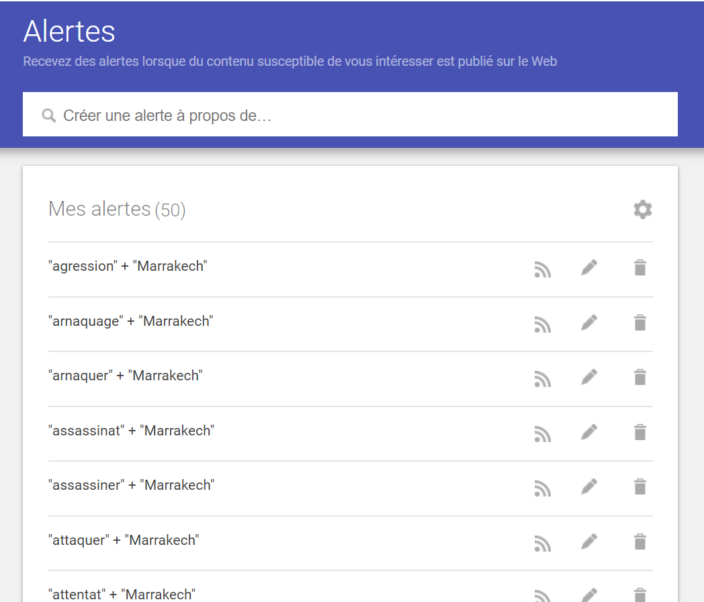

# Qu'est ce que c'est?

<a href="https://www.google.co.ma/alerts">Google Alerts ou Google Alertes</a> est un service qui envoie un e-mail ou une alerte lorsqu'une nouvelle page web correspondant aux mots-clés que l'on a choisi, apparaît dans les résultats Google.

# Fonctionnalités

## Créer une alerte
- Accédez à <a href="https://www.google.co.ma/alerts">Google Alertes</a>.</li>
<li>Dans la zone située en haut de la page, saisissez le sujet que vous souhaitez suivre.</li>
<li>Pour modifier vos paramètres, cliquez sur <b>Afficher les options</b>. Vous pouvez modifier les paramètres suivants:
<ul> Fréquence des notifications.</ul>
<ul> Types de sites affichés.</ul>
<ul> Votre langue.</ul>
<ul> Partie du monde à partir de laquelle vous souhaitez recevoir des informations.</ul>
<ul> Nombre de résultats affichés.</ul>
<ul> Comptes qui reçoivent les alertes.</ul>
</li>
<li>Cliquez sur <b>Créer l'alerte</b>. Vous recevrez des e-mails chaque fois que nous trouverons des résultats de recherche correspondants.</li>

## Modifier une alerte
- Accédez à <a href="https://www.google.co.ma/alerts">Google Alertes</a>.</li>
<li>À côté d'une alerte, cliquez sur Modifier Modifier.</li>
<li>Si aucune option n'est visible, cliquez sur <b>Afficher les options</b>.</li>
<li>Effectuez des modifications.</li>
<li>Cliquez sur <b>Mettre à jour l'alerte</b>.</li>
<li>Pour modifier la façon dont vous recevez les alertes, cliquez sur Paramètres Paramètres puis vérifiez les options qui vous intéressent, puis cliquez sur <b>Enregistrer</b>.</li>

## Supprimer une alerte
- Accédez à <a href="https://www.google.co.ma/alerts">Google Alertes</a>.</li>
<li>À côté de l'alerte que vous souhaitez supprimer, cliquez sur Supprimer Supprimer.</li>

# Exemple réalisé

# Plus d'infos

Pour plus d'infos, visitez le <a href="https://www.google.co.ma/alerts">Site Web</a> de Google Alerts.