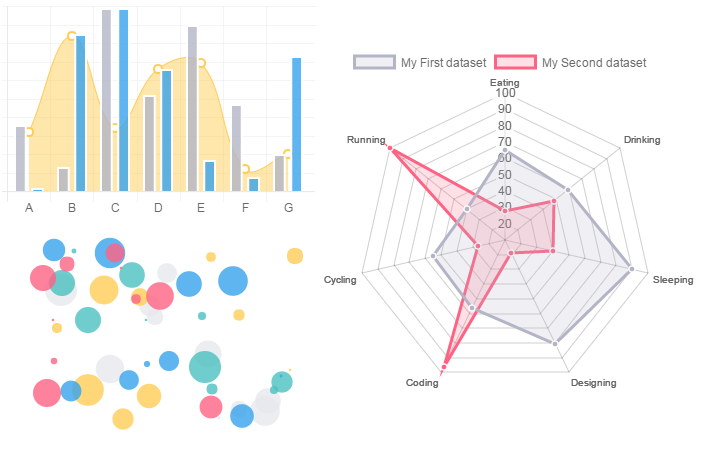

# Qu'est ce que c'est?

<a href="https://www.chartjs.org/">Chart.js</a> est une bibliothèque <b>JavaScript</b> open source conçue pour représenter des données sous forme de graphes statistiques. Elle utilise les fonctionnalités HTML5 comme les canvas et gère l'aspect responsive.
 Vous disposez de huit types de graphiques différents :
- les courbes.</li>
<li>les graphiques en barres.</li>
<li>les camemberts.</li>
<li>les graphiques polaires.</li>
<li>les graphiques en forme de « donuts ».</li>

 

# Exemple d'utilisation

 

# Plus d'infos

Pour plus d'infos, visitez le <a href="https://www.chartjs.org/">Site Web</a> de Chart.js.