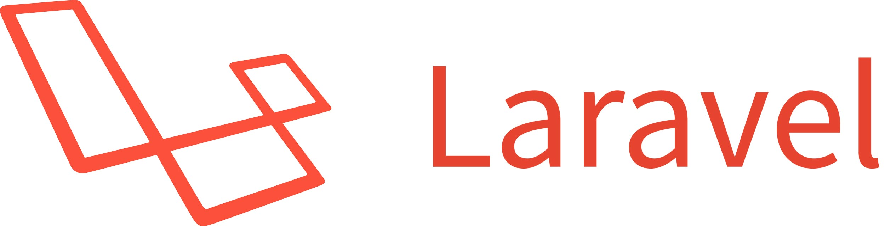
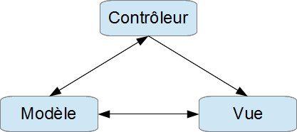

# Qu'est ce que c'est?

<a href="https://laravel.com/">Laravel</a> est un framework web open-source écrit en PHP1 respectant le principe modèle-vue-contrôleur et entièrement développé en programmation orientée objet. Laravel est distribué sous licence MIT, avec ses sources hébergées sur GitHub.
 Créé par Taylor Otwel, initie une nouvelle façon de concevoir un framework en utilisant ce qui existe de mieux pour chaque fonctionnalité. Par exemple toute application web a besoin d'un système qui gère les requêtes HTTP. Plutôt que de réinventer quelque chose, le concepteur de Laravel a tout simplement utilisé celui de <b>Symfony</b> en l'étendant pour créer un système de routage efficace. De la même manière, l'envoi des emails se fait avec la bibliothèque <b>SwiftMailer</b>. En quelque sorte Otwel a fait son marché parmi toutes les bibliothèques disponibles. Nous verrons dans ce cours comment cela est réalisé. Mais Laravel ce n'est pas seulement le regroupement de bibliothèques existantes, c'est aussi de nombreux composants originaux et surtout une orchestration de tout ça.

# MVC ? POO ?

## MVC

On peut difficilement parler d'un framework sans évoquer le patron Modèle-Vue-Contrôleur. Pour certains il s'agit de la clé de voûte de toute application rigoureuse, pour d'autres c'est une contrainte qui empêche d'organiser judicieusement son code. De quoi s'agit-il ? Voici un petit schéma pour y voir clair :

## POO
 
<a href="https://laravel.com/">Laravel</a> est fondamentalement orienté objet. La POO est un design pattern qui s'éloigne radicalement de la programmation procédurale. Avec la POO tout le code est placé dans des classes qui découlent d'interfaces qui établissent des contrats de fonctionnement. Avec la POO on manipule des objets.

# Plus d'infos

Pour plus d'infos, visitez le <a href="https://laravel.com/">Site Web</a> de Laravel.
