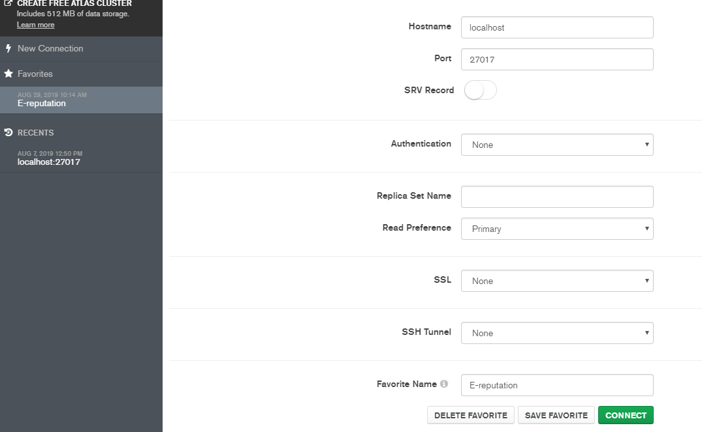

# Qu'est ce que c'est?

<a href="https://www.mongodb.com/fr">MongoDB </a> est un système de gestion de base de données orienté documents, répartissable sur un nombre quelconque d'ordinateurs et ne nécessitant pas de schéma prédéfini des données. Il est écrit en C++. Le serveur et les outils sont distribués sous licence SSPL, les pilotes sous licence Apache et la documentation sous licence Creative Commons. Il fait partie de la mouvance NoSQL.
 <b>La base de données NoSQL</b> est un moyen de stocker des données dans des moyens autres que la base de données relationnelle. Les variétés NoSQL sont ensuite classées par catégories: clé-valeur, colonne, graphique et document, pour en nommer quelques-uns.

# Relationnel vers JSON

Les données utilisées de manière classiques sont en relationnel mais nous devons faire face à un gros problème dans les bases NoSQL : Il faut proscrire les jointures.
  De fait, si on a un SGBDR avec deux tables, on ne pourra pas faire de requêtes de jointure (ou alors, ça va couter horriblement cher). Il faut dans ce cas trouver une solution pour fusionner les deux tables pour n’en produire qu’une seule en sortie. C’est ce qu’on appelle la dénormalisation.
  

## Exemple réalisé

# Plus d'infos

Pour plus d'infos, visitez le <a href="https://www.mongodb.com/fr">Site Web</a> de MongoDB.