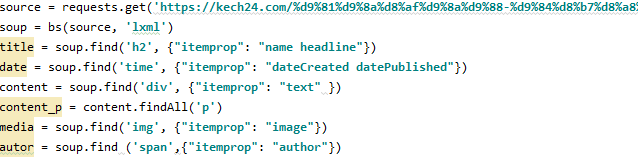
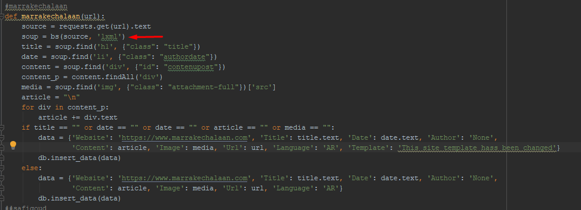
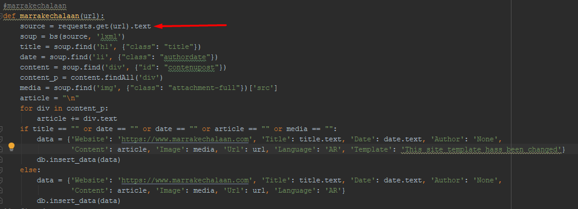

# Qu'est ce que c'est?

<a href="https://www.python.org/"> Python </a> est un langage de programmation interprété, multi-paradigme et multiplateformes. Il favorise la programmation impérative structurée, fonctionnelle et orientée objet. Il est doté d'un typage dynamique fort, d'une gestion automatique de la mémoire par ramasse-miettes et d'un système de gestion d'exceptions ; il est ainsi similaire à Perl, Ruby, Scheme, Smalltalk et Tcl.

# Utilisation

<a href="https://www.python.org/">Python</a> est un langage qui peut s'utiliser dans de nombreux contextes et s'adapter à tout type d'utilisation grâce à des bibliothèques spécialisées. Il est cependant particulièrement utilisé comme langage de script pour automatiser des tâches simples mais fastidieuses. On l'utilise également comme langage de développement de prototype lorsqu'on a besoin d'une application fonctionnelle avant de l'optimiser avec un langage de plus bas niveau. Il possède de nombreuses bibliothèques optimisées destinées au calcul numérique. 

 # Etapes 

 ## Beautiful Soup

 <a href="https://www.crummy.com/software/BeautifulSoup/bs4/doc/">Beautiful Soup </a> est une bibliothèque Python d'analyse syntaxique de documents HTML et XML créée par Leonard Richardson. Elle produit un arbre syntaxique qui peut être utilisé pour chercher des éléments ou les modifier. Lorsque le document HTML ou XML est mal formé, Beautiful Soup propose une approche à base d'heuristiques afin de reconstituer l'arbre syntaxique sans générer d'erreurs. 
  Dans notre cas cette approche est utilisée pour le webscrapping.

### Exemple réalisé

## LXML
LXML est une librairie pour traiter XML et HTML dans Python. 
 XML pour Extensible Markup Language est un langage informatique qui permet l'échange de données entre deux environnements hétérogènes. Un document XML est un arbre composé de noeuds qui peuvent être des éléments ou des attributs.

### Exemple réalisé

## Requests

<a href="https://2.python-requests.org/en/master/">Requests</a> est un module python permettant d'utiliser le protocole http de façon ultra simple.
 Dans notre cas il est utilisé pour apporter les URL voulu.

### Exemple réalisé

## Feedparser

Feedparser est un module Python permettant de télécharger et d’analyser des flux syndiqués.
 Il est utilisé dans ce projet pour lire les flux RSS.

### Exemple réalisé

# Plus d'infos

Pour plus d'infos, visitez le <a href="https://www.python.org">Site Web</a> de Python.

