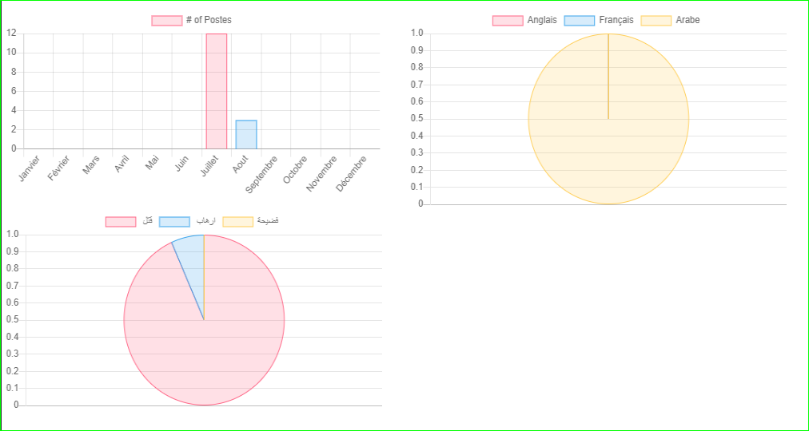

# Guide technique

> Ce volet explique techniquement comment marche chaque section.

## Section 1 : Google Alerts
  
Le résultat correspondant à la requête de recherche sera envoyé au flux RSS.

## Section 2 : Python

### Feedparser

L'URL du flux RSS va être utiliser comme paramètre dans le Feedparser, pour obtenir tous les liens des postes relatifs à la requête de recherche.

 
### Beautiful soup
 
Pour faire le scrapping, il faut retirer les classes et les ids (templates) de chaque site (puisque chaque site a un code qui diffère d'un autre).

## Section 3 : MongoDB

après le scrapping de chaque site, on récupère les informations et on les met dans une base de donnée noSql MongoDB.

## Section 4 : Chartjs

Présentation des statistiques dans un Dashboard.

